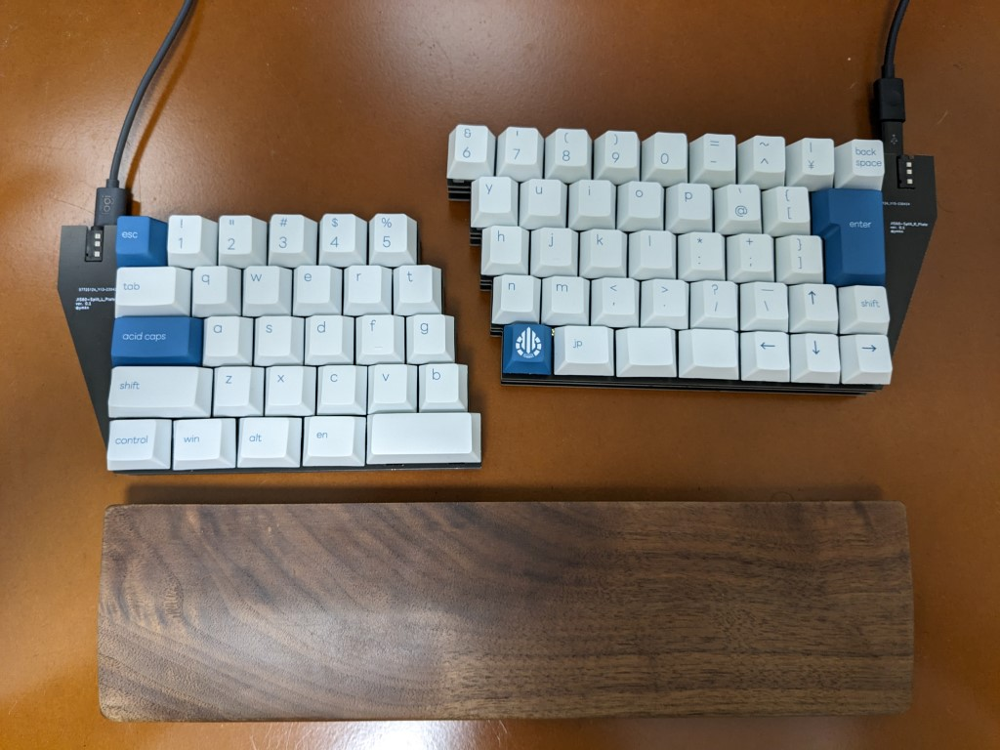
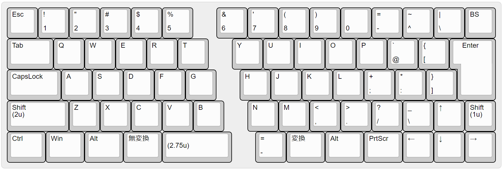

# JIS60-Split Wing

60% sized JIS layout split keyboard.

## Default Layout

Powered by RP2040 with [KMK Firmware](http://kmkfw.io/). Fully customizable.

## Build Guide

See [doc/build-guide.md](doc/build-guide.md)

## License

This project is licensed under the MIT License, see the [LICENSE file](LICENSE) for details.
