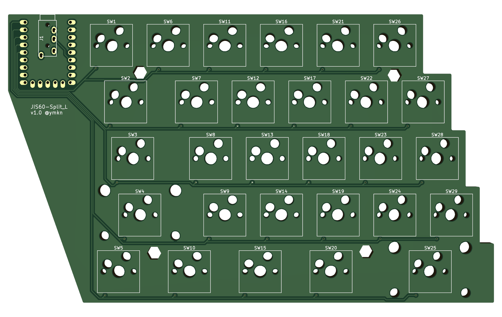
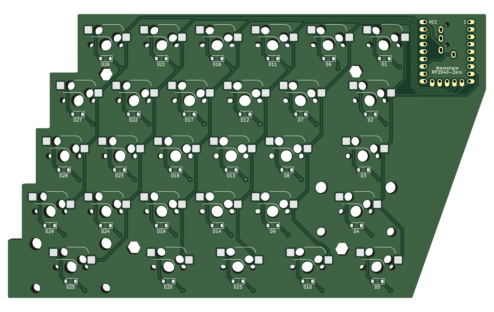
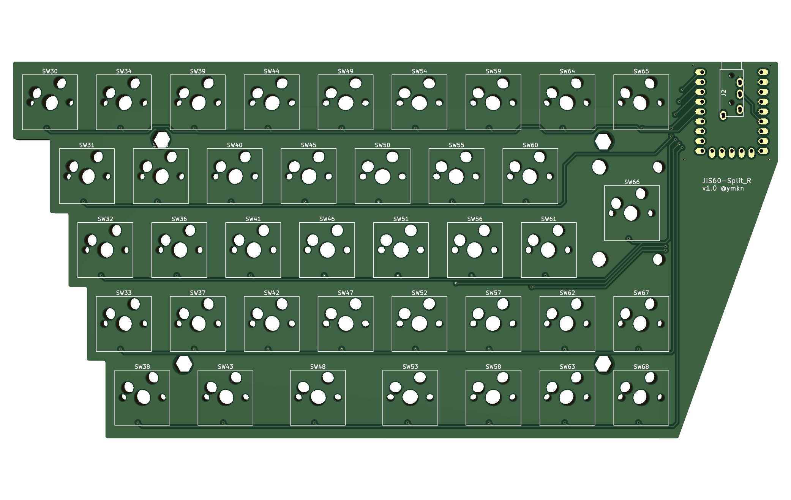
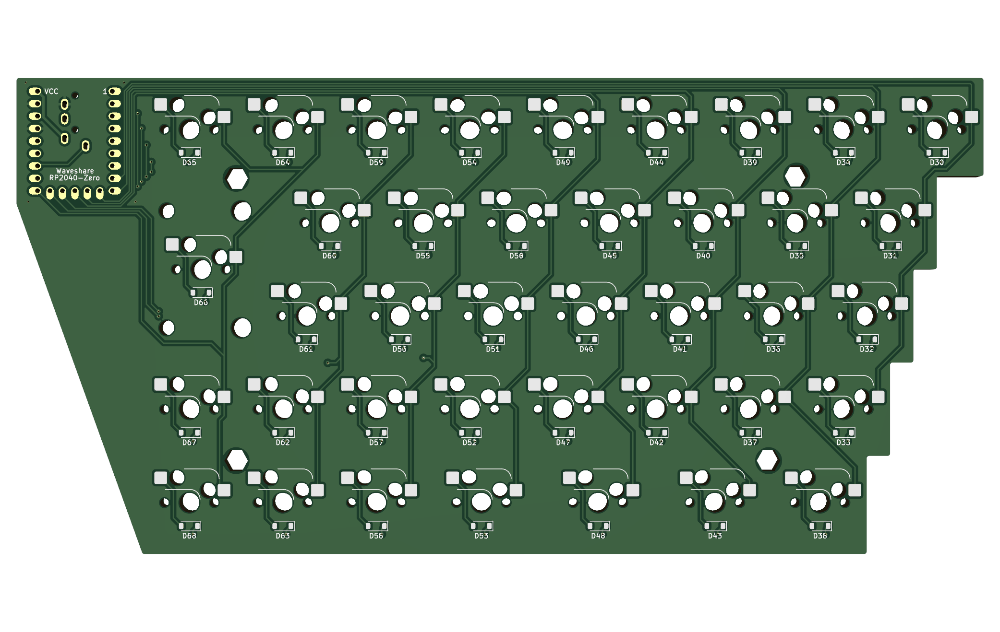

# JIS60-Split Wing ビルドガイド

[TOC]

## 準備

### 基板

本キーボードはPCB、トッププレート、ボトムプレートで構成されています。

自ら基板を発注したい奇特な方へ、JLCPCB向けのGerberファイルが下記にありますのでご活用ください。発注時のオプションでいじる部分は基板の色と配送業者だけです。

- /kicad/JIS60-Split_L/production/gerber.zip
- /kicad/JIS60-Split_L_Plate_Bottom/production/gerber.zip
- /kicad/JIS60-Split_L_Plate_Top/production/gerber.zip
- /kicad/JIS60-Split_R/production/gerber.zip
- /kicad/JIS60-Split_R_Plate_Bottom/production/gerber.zip
- /kicad/JIS60-Split_R_Plate_Top/production/gerber.zip

なおトッププレートは穴が多いとのことで発注後に追加料金を要求されます。支払うまで製造が進みませんのでご注意ください。

### 基板以外の材料

大抵のものは遊舎工房やTALPKEYBOARD等の自作キーボード用品販売サイトで入手できます。電子部品はスイッチサイエンスや秋月電子等の電子工作用品サイトの方が充実しています。M2ねじはバラ買いよりAmazon等で適当な詰め合わせを買う方がお得です。ゴム足は100均で。

|品目|数量|採用例|
|---|---|---|
|Waveshare RP2040-Zero|2||
|ロープロファイル ピンヘッダ ピッチ 2.54mm  23pin分 (9+9+5)|2セット|自分でカットして必要な長さを揃える|
|SMD ダイオード 1N4148W|68|Diodes Incorporated製|
|Kailh スイッチソケット MX用|68||
|3.5mm 4極 ミニジャック (TRRSジャック) |2|AVVICON ELECTRONIC CORPORATION MJ-4PP-9|
|3.5mm 4極 ケーブル (TRRSケーブル) 適度な長さ|1||
|M2 なべネジ 5mm|16||
|M2 六角スペーサ メス-メス 15mm|8||
|好みのゴム足|8||
|PCB取り付けタイプの 2uスタビライザー|3||
|MX互換キースイッチ|68||
|MX互換キーキャップ|一式|必要サイズはレイアウト参照|
|PC接続用 USB Type-C ケーブル (USB 2.0対応)|1||

## 基板全体図

#### PCB左手側表面

#### PCB左手側裏面

#### PCB右手側表面

#### PCB左手側裏面

## 組み立て

### ダイオードの取り付け

PCBの裏面にD1～D68までシルク印刷がありますので、すべてにダイオードをはんだ付けしてください。向きはキーボード上部方向（左手側）がアノード、下部方向（右手側）がカソードです。

テスター等を用いて正しい方向にダイオードが取り付けられていることを確認してください。一つでも間違いがあるとトラブルになるので、面倒でもすべてのダイオードについて確認をお勧めします。

### スイッチソケットの取り付け

PCBの**裏面**にスイッチソケットの外形線と穴がありますので、それに合わせてスイッチソケットをはんだ付けしてください。

### TRRSジャックの取り付け

PCBの**表面**のJ1とシルク印刷がある箇所にTRRSジャックを設置し、**裏面側**からはんだ付けしてください。表裏を間違えるとRP2040-Zeroがはんだ付けできなくなります。

### RP2040-Zeroの取り付け

※必ず、TRRSジャックを先にはんだ付けしてください。RP2040-Zeroをはんだ付けしてしまうと、TRRSジャックのはんだ付けが出来なくなってしまいます。

#### ピンヘッダのはんだ付け

ピンヘッダなし版のRP2040-Zeroを購入した場合は、まずピンヘッダをはんだ付けしてください。

※完成イメージ（Waveshaereサイト掲載画像）

#### PCBへの取りつけ

次に、PCBにRP2040-Zeroをはんだ付けします。

PCBの**裏面**にRP2040-Zeroのシルク印刷がありますので、1番目のピン位置と最終ピン（VCC+5V）の位置を確認してピンを差し込み、**表面側**からはんだ付けします。

## ファームウェア書き込みと動作確認

### CircuitPythonの書き込み

RP2040-ZeroにCircuitPythonを書き込みます。RP2040-ZeroにUSBケーブルを接続後、BOOTボタンを押しながらRESETボタンを押すことでBOOTSELモードに入るとUSBストレージとして認識されると思いますので、そこに[RP2040用CircuitPython](https://circuitpython.org/board/waveshare_rp2040_zero/)のUF2ファイルをコピーするだけです。導入が成功すれば`CIRCUITPY`という名前のUSBストレージがマウントされるはずです。

詳しくは[CircuitPythonのサイト](https://circuitpython.org/)を参照してください。

### KMK Firmwareの書き込み

次に、CircuitPythonを導入します。[KMK FiremwareのGitHubリポジトリ](https://github.com/KMKfw/kmk_firmware)内容のうち、KMKフォルダの内容一式を`CIRCUITPY`ドライブのルートにコピーしてください。

詳しくは[KMK Firmwareのチュートリアル文書](https://github.com/KMKfw/kmk_firmware/blob/master/docs/ja/Getting_Started.md)を参照してください。

### code.pyの書き込み

本キーボード用のキーマップ等の制御ファイルを書き込みます。下記ファイルを`CIRCUITPY`ドライブのルートに上書きコピーしてください。

- code.py

※boot.pyはこの段階では書き込まないでください。動作確認が取れた後に書き込むことをお勧めします。

#### 名前の変更

KMK Firmwareはデバイス名でキーボードの左右を判別しています。下記のように、左手を`L`で終わる名前に、右手を`R`で終わる名前に変更してください。

Windowsであれば、エクスプローラーにて`CIRCUITPY`ドライブを右クリックしプロパティを選択すると名前を変更できます。

- JIS60-SPLT_L
- JIS60-SPLT_R

#### TRRSケーブルの接続

USBケーブルを外してから、TRRSケーブルを接続します。その後、左手側だけにUSBケーブルを接続します。

うまくいけば、この時点でキーボードが認識されているはずです。全キーが正しく動作しているか、仮にスイッチを取り付けて確認しましょう。

## 仕上げ

### boot.pyの書き込み

キーボードの動作が確認できたら、USBケーブルを外してからTRRSケーブルを外し、再度左右それぞれにUSBケーブルを接続して、boot.pyファイルを書き込みます。

- boot.py

boot.pyを書き込むと、次のUSBケーブル接続以後、USBストレージが見えなくなります。再度USBストレージを表示したい場合は、USBケーブル接続時にESCキー（左手側の一番左上のキー）を押したままにしてください。しばらくするとUSBストレージが認識されます。

### スタビライザーの取り付け

Shiftキー、スペースキー、Enterキーの位置に2uサイズのスタビライザーを取り付けます。

### ボトムプレートの組み立て

1. ボトムプレート裏面側からM2ねじを挿し、飛び出しているネジ部分に、六角スペーサーを取り付けてください。
2. これを左右合わせて8つの穴に対して実施してください。

### ボトムプレートとPCB、トッププレートの組み立て

ボトムプレートの六角スペーサーをPCBの穴に通すようにして、PCBとトッププレートを乗せます。トッププレート表面側からM2ねじで六角スペーサーと接続します。

### ゴム足の取り付けとガタつきの確認

ボトムプレート裏面の適切な位置にゴム足を取り付けます。取り付け終わったらガタつきがないか確認してください。ガタつきがある場合、ネジの締めがきつすぎるなどの理由でプレートが反っている可能性があります。

### キースイッチとキャップの取り付け

キースイッチとキーキャップを取り付けたら完成です。おつかれさまでした！
